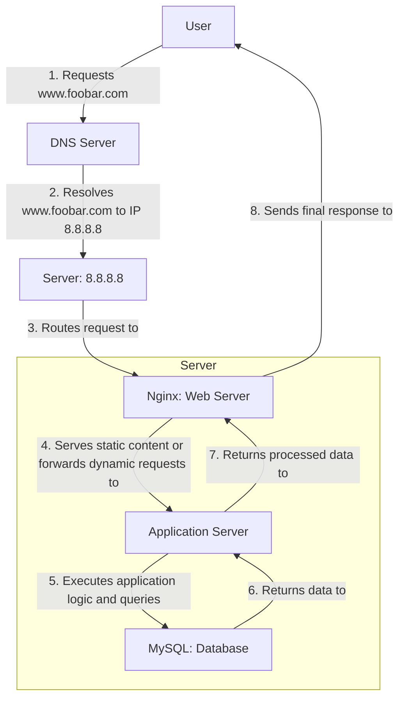

```mermaid
flowchart TD;
    A[User] -->|1. Requests www.foobar.com| B[DNS Server]
    B -->|2. Resolves www.foobar.com to IP 8.8.8.8| C[Server: 8.8.8.8]
    C -->|3. Routes request to| D[Nginx: Web Server]
    D -->|4. Serves static content or forwards dynamic requests to| E[Application Server]
    E -->|5. Executes application logic and queries| F[MySQL: Database]
    F -->|6. Returns data to| E
    E -->|7. Returns processed data to| D
    D -->|8. Sends final response to| A

    subgraph Server
        D[Nginx: Web Server]
        E[Application Server]
        F[MySQL: Database]
    end
```
