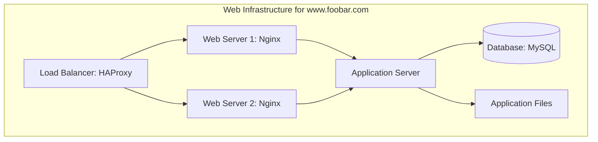

```mermaid
flowchart TD;
    subgraph Web Infrastructure for www.foobar.com
        LB[Load Balancer: HAProxy] --> WS1[Web Server 1: Nginx]
        LB --> WS2[Web Server 2: Nginx]
        WS1 --> AS[Application Server]
        WS2 --> AS
        AS --> DB[(Database: MySQL)]
        AS --> AF[Application Files]
    end
```
