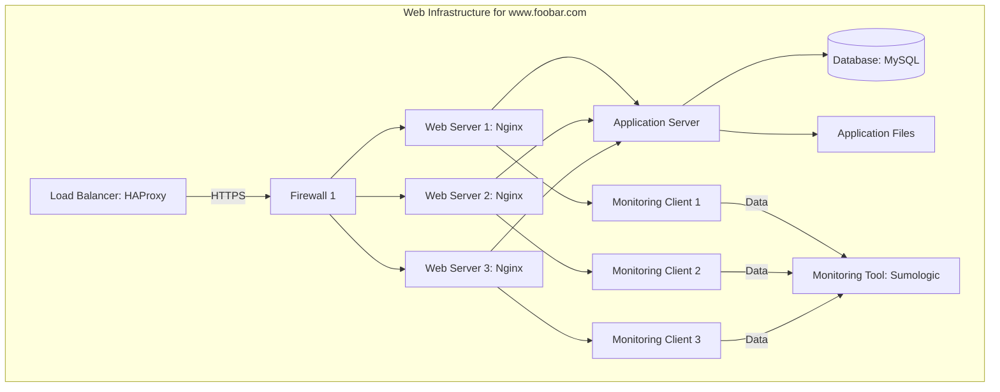

```mermaid
flowchart TD;

    subgraph Web Infrastructure for www.foobar.com
        LB[Load Balancer: HAProxy] -->|HTTPS| FW1[Firewall 1]
        FW1 --> WS1[Web Server 1: Nginx]
        FW1 --> WS2[Web Server 2: Nginx]
        FW1 --> WS3[Web Server 3: Nginx]
        WS1 --> AS[Application Server]
        WS2 --> AS
        WS3 --> AS
        AS --> DB[(Database: MySQL)]
        AS --> AF[Application Files]
        WS1 --> MC1[Monitoring Client 1]
        WS2 --> MC2[Monitoring Client 2]
        WS3 --> MC3[Monitoring Client 3]
        MC1 -->|Data| Monitoring[Monitoring Tool: Sumologic]
        MC2 -->|Data| Monitoring
        MC3 -->|Data| Monitoring
    end
```
